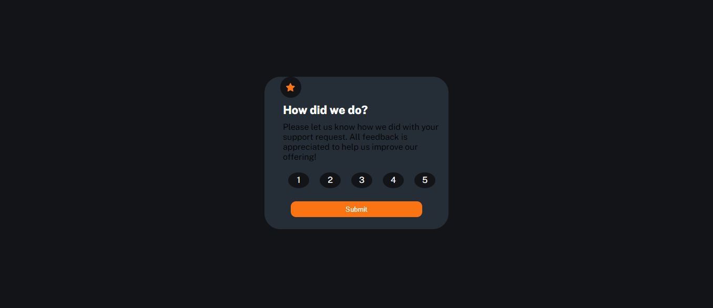

# componente-de-classificacao-interativo
Sistema de classificação, tendo do número 1 ao 5. Mais um desafio do Front end Mentor que conseguir concluir. 

## Tecnologias utilizadas
- HTML
- CSS
- JAVASCRIPT
